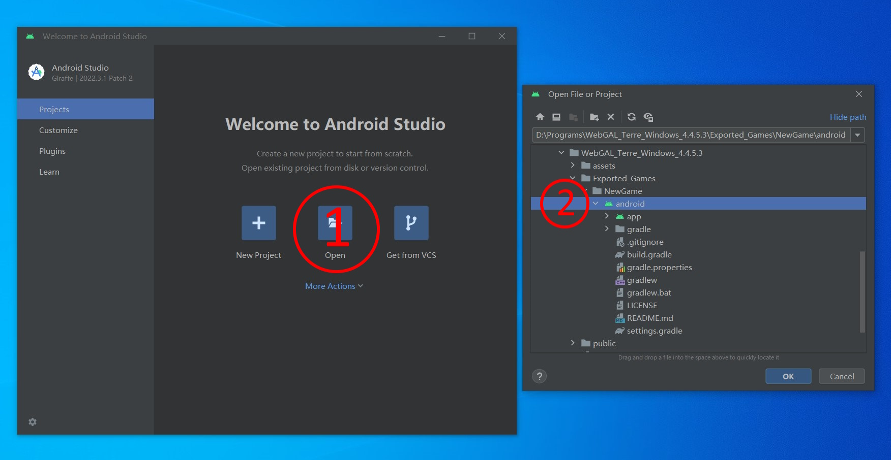

# Andoird

It is recommended to use WebGAL Terre visual editor, which provides an option to export Android project files with one click.

If you build the project using source code, please switch to the source code tab.

## Preparations

::: tabs#android

@tab WebGAL Terre

* Download and install [Android Studio](https://developer.android.com/studio)

@tab Source code

* Download and install [Android Studio](https://developer.android.com/studio)
* Compile [WebGAL](https://github.com/MakinoharaShoko/WebGAL) to Web page
* Download [WebGAL Android project template](https://github.com/nini22P/WebGAL-Android)

:::

## Open the project in Android Studio

::: warning
If you want to use Android Studio to open the folder directly exported from the project, please fill in **English** when creating a new game. If the game folder name is not English, please rename it to English in the more menu or open `WebGAL_Terre\public\games` to modify your game name, and ensure that there are no non-English characters in the project file path, otherwise an error will be reported
:::

::: tabs#android

@tab WebGAL Terre

Modify the `Game title` and `Game package name` in the game configuration in the left sidebar of the editor.
The game package name is the reverse of your website domain name. If you don't have a domain name, you can consider using the combination of developer plus game name, such as `webgaldev.mygalgame`, **must** use **English**.

Select Export to Android project file in the upper right corner of the editor, and the system will automatically open the folder.

Open android studio and select the `android` directory that was just exported, and wait for the dependency download to complete.



@tab Source code

Download and unzip the [project template](https://github.com/nini22P/WebGAL-Android), and rename the folder (remember to use English).
Open the `project folder\app\src\main\assets\webgal` folder and put the game you want to package here.

The game loads `project folder\app\src\main\assets\webgal\index.html` by default. If you want to customize the loading link (such as an online link), please modify the `load_url` field in the `project folder\app\src\main\res\values\values.xml` file.

Open Android Studio to open the project.
Modify the `rootProject.name` field in the `project folder\settings.gradle` file.

``` gradle
...
rootProject.name = "WebGAL" //Modify the project title
...
```

Modify the title information in `project folder\app\src\main\res\values\strings.xml`.

``` xml
<resources>
    <string name="app_name">WebGAL</string> //Modify the game title
</resources>
```

Modify the `namespace` and `applicationId` fields in `project folder\app\build.gradle` to the reverse of the domain name.

``` gradle
...
android {
    namespace 'com.openwebgal.demo' //Modify the package name
...
    defaultConfig {
        applicationId "com.openwebgal.demo" //Modify the package name
...
```

Click `File -> Sync Project with Gradle files` in the menu bar and wait for the synchronization to complete.

Modify the `package` field in the first line of `project folder\app\src\main\java\com\openwebgal\demo\MainActivity.kt` to the target package name changed earlier.

``` kotlin
package com.openwebgal.demo //Modify the package name
...
```

After modifying this field, an error will be reported. At this time, click the package name just modified, and then click the "yellow light bulb" to select `Move file to 'target package name'`, and then delete the original package name folder.

:::

Click `File -> New -> Image Asset` in the menu bar to modify the game icon. Note that the icon is divided into two layers, front and back.


## Debug and run

Turn on USB debugging on your Android phone and connect it to your computer. Click the run icon next to the device title in the toolbar above to run it on your phone.


## Compile APK

Click `Build -> Generate Signed Bundle or APK` in the menu bar, and select `APK` in the pop-up menu.

Create or select a key according to the prompts.


Select `release` and click `Create` to wait for the compilation to complete.


## Video tutorial

[Use Android Studio to package WebGAL games to the Android platform](https://www.bilibili.com/video/BV1m24y1J7ct/)

## Compatibility and solutions

Currently, the minimum supported version is Android 5.0, and it depends on the pre-installed Android System WebView of the system. If your device goes black after clicking the first screen, please try any of the following solutions:

1. Enter the Play Store to update [Android System WebView](https://play.google.com/store/apps/details?id=com.google.android.webview)
2. Manually download Android System WebView for update

Android System WebView download link: [Android 5.0](https://www.apkmirror.com/apk/google-inc/android-system-webview/android-system-webview-95-0-4638-74-release/) | [Android 6.0](https://www.apkmirror.com/apk/google-inc/android-system-webview/android-system-webview-106-0-5249-126-release/) | [Android 7.0 +](https://www.apkmirror.com/apk/google-inc/android-system-webview/)