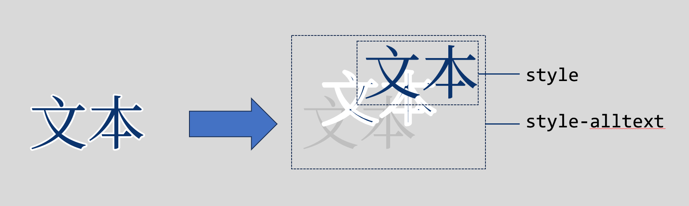

# Dialogue

::: warning
Colons and semicolons in each dialogue should be English characters!
:::

**The way to write character dialogue is very simple, and it is almost the same as natural language.**

::: info
When the font is medium and large, the text box displays 2 lines, and when the font is small, it displays 3 lines.
:::

## Basic Character Dialogue

First, open `start.txt` in the `scene` folder of the game resource directory using Notepad or a text editor such as VS Code or sublime, and then you can start writing your first dialogue.

The way to write character dialogue is very simple, you just need to enter `Character: dialogue;`

Example:

``` ws
Yukino Yukinoshita: Please have some tea;
Yui Yuigahama: Ah, thank you;
Komachi: Thank you, Sister Yukino!;
Iroha Isshiki: Thank you, senior. ;
```

After each dialogue/script, use a semicolon as the end. (Sometimes it works if you don't write a semicolon, but the author still recommends adding a semicolon to prevent bugs).

## Continuous Dialogue

If your multiple dialogues do not change the character name, you can use continuous dialogue, and you can omit the character name, and use it when you need it:

``` ws
Yukino Yukinoshita: You're here early;
; // At this time, the character name of the dialogue is still "Yukino Yukinoshita"
Sorry, have you been waiting long?;
Hachiman Hikigaya: Just arrived;
```

## Narration

If you want to create a monologue dialogue without a character name, leave a blank space before the colon (but do not omit the colon):

``` ws
:This is a monologue;
```

## Blackout Text

In many games, some text is displayed on a black screen, which is used to introduce the theme or express the character's mental activities. You can use the intro command to perform a monologue:

``` ws
intro: Memories don't need a suitable script, | Anyway, once you say it, | It all becomes a joke. ;
```

The monologue is split by the separator (|), that is, each | represents a line break. In the actual performance, the above text will become:

``` ws
Memories don't need a suitable script,
Anyway, once you say it,
It all becomes a joke.
```

If you want to keep the monologue UI after the monologue ends instead of continuing the game flow, use the ` -hold` parameter.

``` ws
intro:Recalling doesn't need a suitable script,|anyway, once it's spoken,|it all becomes a joke. -hold;
```

## Get User Input

Use the `getUserInput` instruction to get user input and write it into a variable, for example:

```
getUserInput:name -title=What is your name -buttonText=OK; Write user input to variable name
```

Among them, the `title` parameter is the text of the prompt, and `buttonText` is the text of the confirmation button

## Variable Interpolation

You can use the `{}` syntax in a statement to perform variable interpolation and pass a variable into the statement, for example:

```
WebGAL: Nice to meet you, {name}!
```

Variable interpolation also applies to character names, for example:

```
{name}: I like WebGAL the most too!;
```

## Ruby

Adding ruby to dialogue text is a very common performance effect in Japanese games. Because there are often some words in Japanese that are inconsistent in writing and pronunciation.

The grammar of Ruby is `[Word to be annotated](annotation)`

Example:

```
『[笑顔](えがお)』なんて、『[笑う](わらう)』なんて、[誰](だれ)でも[出来](でき)るもん…！
```

## Text Enhancement Syntax

In WebGAL 4.5.3, the "text enhancement syntax" feature has been added. This syntax allows you to add text styles to specific text.

Text enhancement syntax is an enhancement to a specific piece of text. Text enclosed in [] and followed by () as a text enhancement description is text that conforms to the text enhancement syntax definition.

In simple terms, it takes the following form:

```
(Text)[style-alltext=font-style:italic\; style=color:#66327C\; ruby=wen ben]
```

This means that the font size of this text is smaller, and it is bold, the color is #005CAF, and it has phonetic annotations and tooltips.

For different parameters in the text enhancement syntax, use spaces to separate them, and the form is always `argk=argv`.

It is important to note that because ; is the comment syntax of WebGAL, you need to add \ to escape it in the text enhancement syntax, which becomes \;.

### Scope of Style Effects for Different Parameters



In the previous example syntax, notice that there are two different parameters that can define styles for text: `style` and `style-alltext`.

The reason for distinguishing the scope of text styles is that in order to provide a better stroke effect for text, WebGAL divides a character into three layers: text, stroke, and placeholder.

Text is the topmost part and the main part. The stroke is below the text and is covered by the text to provide a white stroke without destroying the internal shape of the text. The bottom layer is a transparent placeholder that provides positioning.

In short, if you only need to change the text color, you only need to use the `style` parameter. If you want to apply effects such as italics, text size, internal and external margins, you need to set the effects for `style-alltext` at the same time.

**Special note: Due to a bug in version 4.5.3, it is currently not possible to apply only the style-alltext parameter, because the text enhancement syntax is only activated when the syntax `style=` is detected.**

### Compatibility with Phonetic Annotations

For compatibility with the previous syntax, if the syntax `style=` is not recognized, then we will treat the `()[]` syntax as a phonetic annotation.

If the new text enhancement syntax is used, the phonetic annotation is written in the `ruby=` parameter, as illustrated in the example above.

## Close the Text Box

Sometimes, for some special performance effects, you may want to temporarily close the text box, so you can use the following instructions to close the text box:

``` ws
setTextbox:hide; // Close the text box
```

When the value of the `setTextbox` instruction is `hide`, the text box will be closed and the user will not be able to open it in any way. If you want to display the text box again, call this command again and enter any value other than `hide`.

``` ws
setTextbox:on; // Can be any value other than hide.
```

## End the Game and Return to Title

If you want to end the game and return to the title after the plot, please use:

``` ws
end;
```

In this way, the game can return to the title interface.

## Cinematic Mode (Test Feature)

Use `filmMode:enable;` to enable cinematic mode.
Use `filmMode:none;` to disable cinematic mode.
