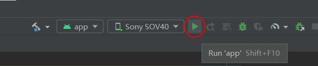
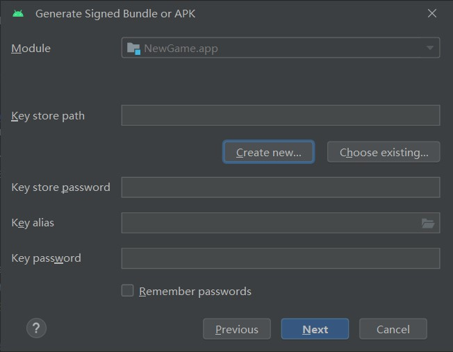

# Andoird

WebGAL Terre 可視化編輯器をお勧めします。一键でアンドロイドプロジェクトファイルのエクスポートオプションを提供しています。

ソースコードでプロジェクトを構築する場合は、ソースコードオプションに切り替えてください。

## 前期準備

::: tabs#android

@tab WebGAL Terre

* [Android Studio](https://developer.android.com/studio)をダウンロードしてインストールします。

@tab ソースコード

* [Android Studio](https://developer.android.com/studio)をダウンロードしてインストールします。
* [WebGAL](https://github.com/OpenWebGAL/WebGAL)をWebウェブにコンパイルします。
* [WebGAL Android プロジェクトテンプレート](https://github.com/nini22P/WebGAL-Android)をダウンロードします。

:::

## Android Studioでプロジェクトを開く

::: warning
プロジェクトのエクスポートされたフォルダから直接Android Studioで開きたい場合は、ゲームを新規作成する際に**英語**を入力してください。ゲームフォルダ名が英語でない場合は、詳細メニューで英語に名前を変更するか、`WebGAL_Terre\public\games`を開いてゲーム名を変更し、プロジェクトのファイルパスに英語以外の文字が含まれないようにしてください。そうしないと、エラーが発生します。
:::

::: tabs#android

@tab WebGAL Terre

エディタのトップバーで、ゲーム設定の `ゲームタイトル`、`ゲームパッケージ名`、および `ゲームアイコン` を変更します。
ゲームパッケージ名は、あなたのウェブサイトのドメインを逆にしたものです。ドメインがない場合は、デベロッパーとゲーム名を組み合わせたもの、例えば「webgaldev.mygame」のような形式を検討してください。**必ず****英語**を使用してください。

エディタの右上にある「アンドロイドプロジェクトファイルにエクスポート」を選択すると、システムが自動的にフォルダを開きます。

android studioを開き、エクスポートしたばかりの「android」ディレクトリを開き、依存関係のダウンロードが完了するまで待ちます。


@tab ソースコード

[プロジェクトテンプレート](https://github.com/nini22P/WebGAL-Android)をダウンロードして解凍し、フォルダの名前を変更します（必ず英語を使用してください）。
「プロジェクトフォルダ\app\src\main\assets\webgal」フォルダを開き、パッケージ化するゲームをここに置きます。

ゲームはデフォルトで「プロジェクトフォルダ\app\src\main\assets\webgal\index.html」を読み込みます。オンラインリンクなど、読み込みリンクをカスタマイズしたい場合は、「プロジェクトフォルダ\app\src\main\res\values\values.xml」ファイル内の「load_url」フィールドを変更してください。

Android Studioを開いてプロジェクトを開きます。
「プロジェクトフォルダ\settings.gradle」ファイルの「rootProject.name」フィールドを変更します。

```
...
rootProject.name = "WebGAL" //プロジェクトタイトルを変更
...
```

「プロジェクトフォルダ\app\src\main\res\values\strings.xml」のタイトル情報を変更します。

``` xml
<resources>
    <string name="app_name">WebGAL</string> //ゲームタイトルを変更
</resources>
```

「プロジェクトフォルダ\app\build.gradle」の「namespace」と「applicationId」フィールドを、ドメインを逆にした形式に変更します。

```
...
android {
    namespace 'com.openwebgal.demo' //パッケージ名を変更
...
    defaultConfig {
        applicationId "com.openwebgal.demo" //パッケージ名を変更
...
```

メニューバーの「ファイル -> Gradleファイルでプロジェクトを同期」をクリックして、同期が完了するまで待ちます。

「プロジェクトフォルダ\app\src\main\java\com\openwebgal\demo\MainActivity.kt」の最初の行の「package」フィールドを、前に変更したターゲットパッケージ名に変更します。

``` kotlin
package com.openwebgal.demo //パッケージ名を変更
...
```

このフィールドを変更するとエラーが発生します。このとき、変更したばかりのパッケージ名をクリックして、「黄色い電球」をクリックし、「ファイルを「ターゲットパッケージ名」に移動」を選択し、元の「パッケージ名」フォルダを削除します。

メニューバーの `File -> New -> Image Asset` をクリックしてゲームアイコンを変更します。アイコンは前後2層に分かれています。


:::

## デバッグ実行

アンドロイド携帯のUSBデバッグをオンにしてパソコンに接続し、ツールバーの上にあるデバイスタイトルの横にある実行アイコンをクリックして携帯で実行します。



## APKをコンパイルする

メニューバーの「ビルド -> 署名付きバンドルまたはAPKを生成」をクリックし、ポップアップメニューで「APK」を選択します。

プロンプトに従ってキーを作成または選択します。



「release」を選択して「作成」をクリックし、コンパイルが完了するまで待ちます。


## ビデオチュートリアル

[Android Studioを使ってWebGALゲームをAndroidプラットフォームにパッケージする](https://www.bilibili.com/video/BV1m24y1J7ct/)

## 互換性と解決策

サポートされている最小バージョンはAndroid 5.0で、システムにプリインストールされたAndroid System WebViewに依存しています。初回画面をクリックした後に黒い画面やその他の問題が発生した場合は、以下のいずれかの解決策を試してください。

* Playストアにアクセスして、[Android System WebView](https://play.google.com/store/apps/details?id=com.google.android.webview)を更新します。
* [Android System WebView](https://www.apkmirror.com/apk/google-inc/android-system-webview/) を手動でダウンロードして更新します。
* HuaweiのAndroidデバイスを使用している場合は、[Huawei WebView](https://www.apkmirror.com/apk/huawei/huawei-webview-2/)をダウンロードしてインストールしてみてください。
